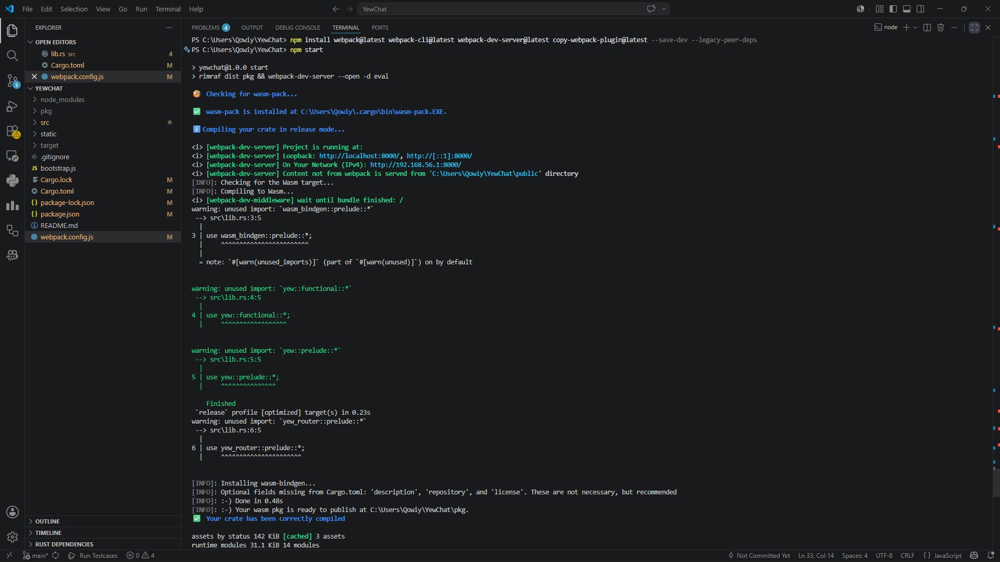
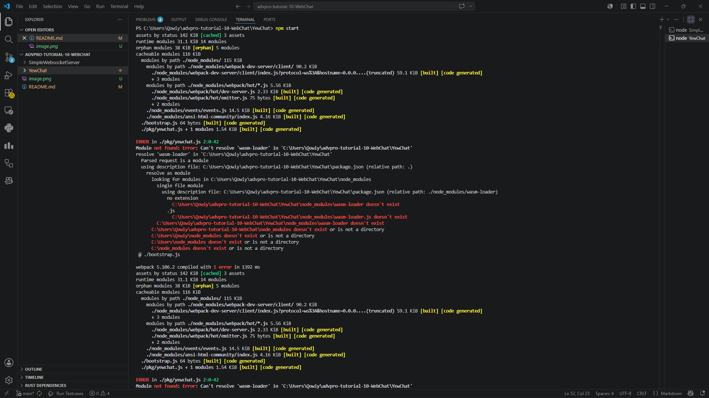
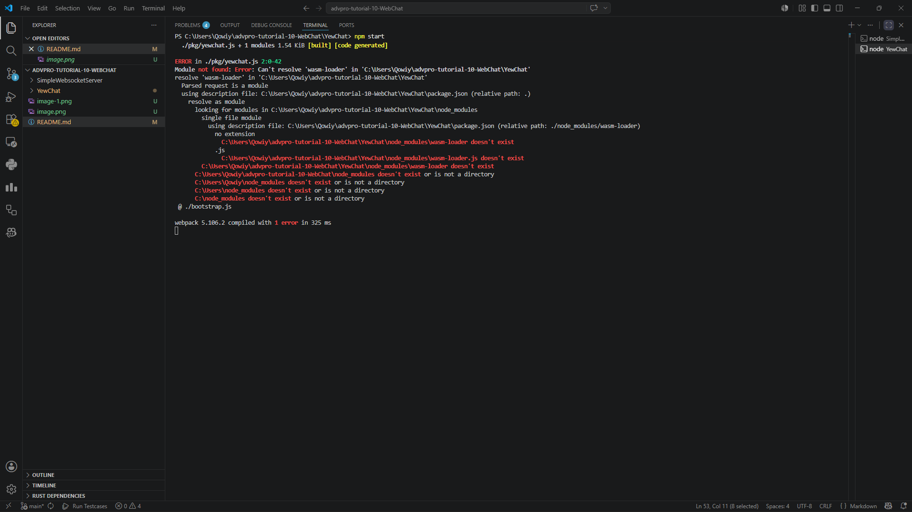

## Experiment 3.1: Original Code

Pada eksperimen ini, saya mencoba menjalankan aplikasi WebChat berbasis Yew sesuai tutorial yang diberikan pada modul praktikum.

Repository yang digunakan:
- Web client YewChat
- SimpleWebsocketServer sebagai websocket server

### Langkah Menjalankan Server

Masuk ke folder websocket server:

cd SimpleWebsocketServer
npm install
npm start

Server websocket berhasil dijalankan menggunakan Node.js.

Langkah Menjalankan YewChat

Masuk ke folder YewChat:

cd YewChat
cargo update
npm install
npm start

Project berhasil melakukan proses compile Rust ke WebAssembly menggunakan wasm-pack.

Output terminal menunjukkan:

Your wasm pkg is ready to publish
Your crate has been correctly compiled
Kendala yang Ditemukan

Meskipun proses compile Rust dan WebAssembly berhasil, project mengalami error pada webpack ketika memproses file .wasm.

Error yang muncul:

ERROR in ./pkg/yewchat_bg.wasm
Module parse failed: Unknown element type in table: 0xNaN

Error ini terjadi karena project original menggunakan konfigurasi webpack lama yang kurang kompatibel dengan versi Rust dan WebAssembly terbaru yang digunakan saat ini.

Namun demikian:

websocket server berhasil dijalankan,
proses compile Rust berhasil,
package .wasm berhasil dibuat,
dan struktur original project berhasil dipelajari serta dijalankan sebagian sesuai tutorial.

